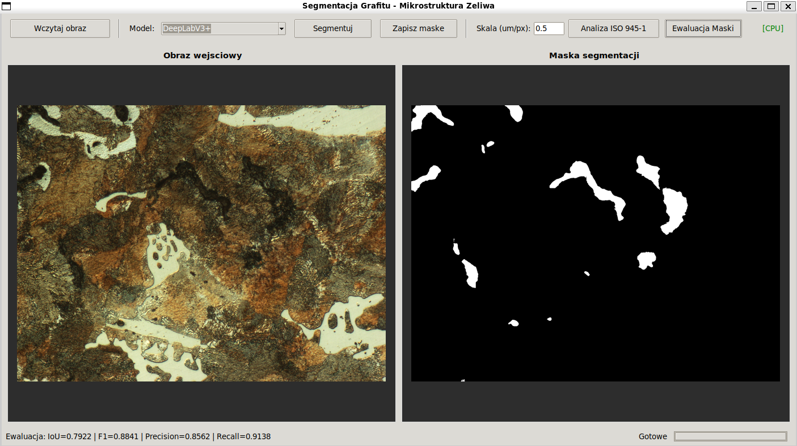
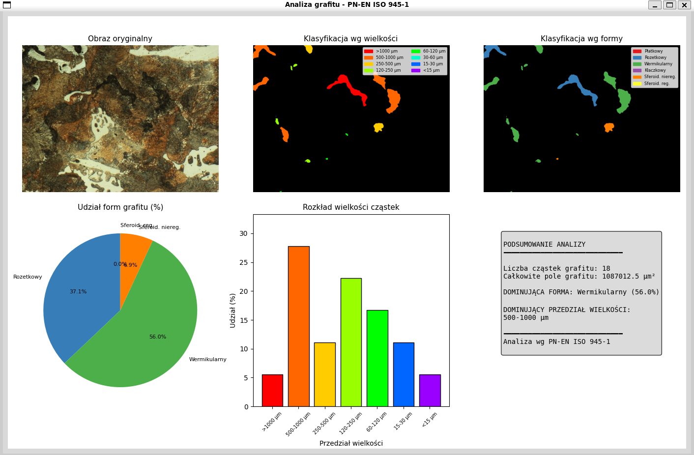
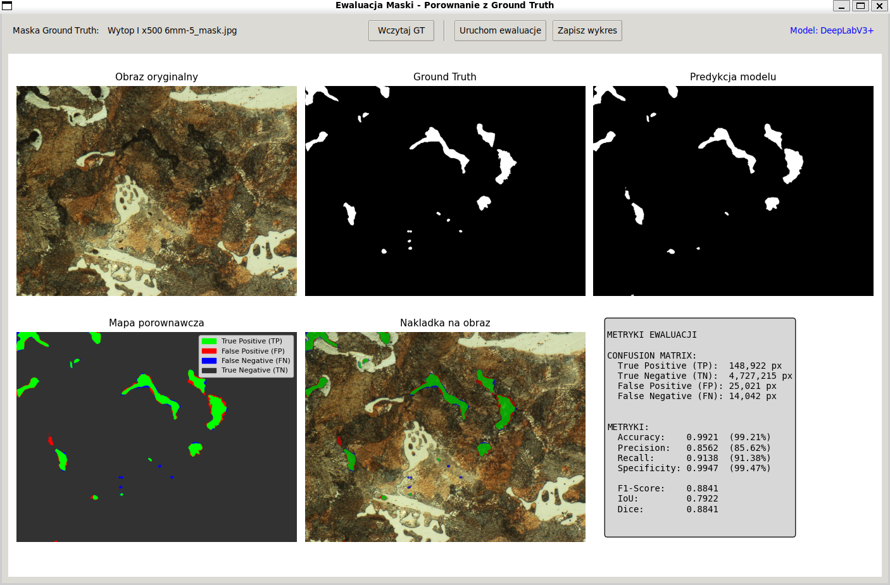

# 🔬 System Segmentacji Grafitu w Mikrostrukturach Żeliwa

<p align="center">
  
  
</p>

Aplikacja desktopowa do automatycznej segmentacji grafitu na obrazach mikrostruktur żeliwa z wykorzystaniem głębokich sieci neuronowych oraz analizy morfologicznej zgodnej z normą **PN-EN ISO 945-1**.

---

## 📋 Spis treści

- [Funkcjonalności](#-funkcjonalności)
- [Architektura modeli](#-architektura-modeli)
- [Instalacja](#-instalacja)
- [Uruchomienie](#-uruchomienie)
- [Struktura projektu](#-struktura-projektu)
- [Interfejs użytkownika](#-interfejs-użytkownika)
- [Analiza ISO 945-1](#-analiza-iso-945-1)
- [Ewaluacja maski](#-ewaluacja-maski)

---

## ✨ Funkcjonalności

| Funkcja | Opis |
|---------|------|
| **Segmentacja** | Automatyczna detekcja grafitu przy użyciu DeepLabV3+ lub U-Net |
| **Analiza ISO 945-1** | Klasyfikacja cząstek wg wielkości (8 klas) i formy (6 form) |
| **Wizualizacja** | Kolorowe mapy klasyfikacji, wykresy rozkładów |
| **Ewaluacja** | Porównanie predykcji z ground truth (IoU, F1, Dice) |
| **Eksport** | Zapis masek (PNG), wyników analizy (CSV), wykresów (PNG/PDF) |

---

## 🧠 Architektura modeli

### DeepLabV3+ (zalecany)
- Encoder: ResNet-50 z atrous convolution
- Moduł ASPP (Atrous Spatial Pyramid Pooling)
- Dekoder z low-level features fusion
- **IoU na zbiorze testowym: ~0.85+**

### U-Net
- Klasyczna architektura encoder-decoder
- Skip connections dla zachowania detali
- Warianty z/bez filtracji danych

---

## 🛠 Instalacja

### 1. Klonowanie repozytorium
```bash
git clone https://github.com/cymo26/graphite_segmentation_system.git
cd graphite_segmentation_system
```

### 2. Utworzenie środowiska wirtualnego
```bash
python -m venv labeller_env
source labeller_env/bin/activate  # Linux/Mac
# lub: labeller_env\Scripts\activate  # Windows
```

### 3. Instalacja zależności
```bash
pip install -r requirements.txt
```

### Wymagania systemowe
- Python 3.10+
- PyTorch 2.0+ (z obsługą CUDA dla GPU)
- 8GB RAM (16GB zalecane)
- GPU NVIDIA z CUDA (opcjonalne, przyspiesza ~10x)

---

## 🚀 Uruchomienie

### Szybki start (Linux/Mac)
```bash
# 1. Sklonuj repozytorium
git clone https://github.com/cymo26/graphite_segmentation_system.git
cd graphite_segmentation_system

# 2. Utwórz i aktywuj środowisko wirtualne
python3 -m venv labeller_env
source labeller_env/bin/activate

# 3. Zainstaluj zależności
pip install -r requirements.txt

# 4. Uruchom aplikację
cd App/src
python main.py
```

### Szybki start (Windows)
```powershell
# 1. Sklonuj repozytorium
git clone https://github.com/cymo26/graphite_segmentation_system.git
cd graphite_segmentation_system

# 2. Utwórz i aktywuj środowisko wirtualne
python -m venv labeller_env
labeller_env\Scripts\activate

# 3. Zainstaluj zależności
pip install -r requirements.txt

# 4. Uruchom aplikację
cd App\src
python main.py
```

### Co się dzieje po uruchomieniu?
Aplikacja automatycznie:
- ✅ Wykrywa dostępność GPU (CUDA) — jeśli brak, używa CPU
- ✅ Ładuje wytrenowane modele z `App/src/models/`
- ✅ Kompiluje modele (`torch.compile`) dla przyspieszenia (PyTorch 2.0+)
- ✅ Uruchamia okno interfejsu graficznego

### Rozwiązywanie problemów

| Problem | Rozwiązanie |
|---------|-------------|
| `ModuleNotFoundError: No module named 'torch'` | Upewnij się, że środowisko jest aktywne i uruchom `pip install -r requirements.txt` |
| `CUDA not available` | Zainstaluj PyTorch z obsługą CUDA: `pip install torch --index-url https://download.pytorch.org/whl/cu118` |
| `Nie znaleziono modeli` | Sprawdź czy pliki `.pth` istnieją w `App/src/models/` |
| `Tkinter not found` (Linux) | Zainstaluj: `sudo apt-get install python3-tk` |

---

## 📁 Struktura projektu

```
Graphite_segmentation_system/
├── App/
│   ├── src/
│   │   ├── main.py              # Punkt wejścia aplikacji
│   │   ├── gui.py               # Interfejs graficzny (Tkinter)
│   │   ├── segmentation.py      # Architektury sieci i predykcja
│   │   ├── analysis.py          # Analiza ISO 945-1
│   │   ├── mask_evaluation.py   # Ewaluacja masek (IoU, F1, etc.)
│   │   └── models/              # Wytrenowane modele (.pth)
│   │       ├── DEEPLABV3_WITH_FILTRATION/
│   │       ├── U-NET_WITH_FILTRATION/
│   │       └── U-NET_WITHOUT_FILTRATION/
│   ├── data/
│   │   ├── raw/                 # Surowe obrazy mikrostruktur
│   │   └── processed/
│   │       ├── masks/           # Maski ground truth
│   │       └── split/           # Podział train/val/test
│   └── notebooks/               # Jupyter notebooks (trening, wizualizacja)
├── django-labeller/             # Narzędzie do etykietowania obrazów
├── requirements.txt
└── README.md
```

---

## 🖥 Interfejs użytkownika

### Panel główny
1. **Wczytaj obraz** — wybór obrazu mikrostruktury (JPG, PNG, TIFF)
2. **Model** — wybór architektury (DeepLabV3+, U-Net)
3. **Segmentuj** — uruchomienie predykcji
4. **Zapisz maskę** — eksport maski binarnej
5. **Analiza ISO 945-1** — klasyfikacja morfologiczna
6. **Ewaluacja Maski** — porównanie z ground truth

### Parametry
- **Skala (µm/px)** — przelicznik pikseli na mikrometry (domyślnie 0.5)
---


## 📊 Analiza ISO 945-1

Klasyfikacja grafitu zgodna z normą PN-EN ISO 945-1:

### Klasy wielkości (wg maksymalnej średnicy Fereta)
| Klasa | Zakres |
|-------|--------|
| 1 | >1000 µm |
| 2 | 500-1000 µm |
| 3 | 250-500 µm |
| 4 | 120-250 µm |
| 5 | 60-120 µm |
| 6 | 30-60 µm |
| 7 | 15-30 µm |
| 8 | <15 µm |

### Formy grafitu
| Forma | Nazwa | Opis |
|-------|-------|------|
| I | Płatkowy | Lamellar |
| II | Rozetkowy | Rosette |
| III | Wermikularny | Vermicular/Compacted |
| IV | Kłaczkowy | Undercooled |
| V | Sferoid. nieregularny | Irregular nodular |
| VI | Sferoid. regularny | Regular nodular |
---


## 📈 Ewaluacja maski

Moduł porównania predykcji z maską referencyjną (ground truth):

### Metryki
- **IoU** (Intersection over Union)
- **Dice Coefficient** (F1-Score)
- **Precision / Recall**
- **Accuracy**
- **TP / FP / FN / TN** (liczba pikseli)

### Wizualizacja
- Mapa kolorowa: TP (zielony), FP (czerwony), FN (niebieski), TN (szary)
- Nakładka na oryginalny obraz
- Automatyczne wczytywanie maski GT na podstawie nazwy pliku
---


## 📚 Biblioteki

| Biblioteka | Zastosowanie |
|------------|--------------|
| PyTorch | Sieci neuronowe, GPU inference |
| Tkinter | Interfejs graficzny |
| OpenCV | Przetwarzanie obrazów, kontury |
| scikit-image | Analiza regionów (regionprops) |
| Matplotlib | Wizualizacje, wykresy |
| Pandas | Eksport danych do CSV |
| Pillow | Ładowanie/zapis obrazów |

---

## 👤 Autor
Jakub Cymiński
Projekt inżynierski — AGH

---


